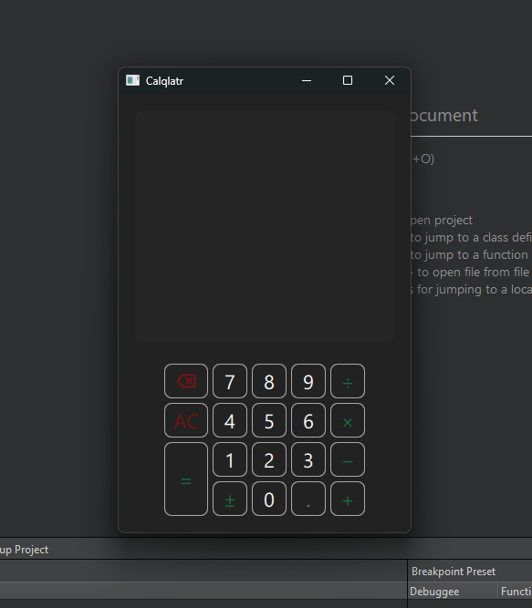

# 🖩 Calculadora em C++ com Qt

Este projeto é uma **calculadora desenvolvida em C++** com interface gráfica criada usando **Qt**. O objetivo principal foi treinar a escrita de código em C++ e explorar o uso do framework Qt para construção de interfaces de usuário.

---

## 📸 Pré-visualização

  

---

## 🛠️ Tecnologias Utilizadas

- **Linguagem**: C++
- **Interface Gráfica**: Qt Framework

---

## 🔍 Funcionalidades

- Realiza operações matemáticas básicas:
  - Adição
  - Subtração
  - Multiplicação
  - Divisão
- Interface gráfica intuitiva e responsiva, desenvolvida com Qt.

---

## Objetivo do Projeto

- Praticar a programação em C++.
- Explorar o desenvolvimento de interfaces gráficas com o **Qt Framework**.
- Entender conceitos de manipulação de eventos e criação de componentes de interface em C++.

---

📚 *Projeto desenvolvido para aprimorar habilidades em C++ e criação de interfaces com Qt.*
